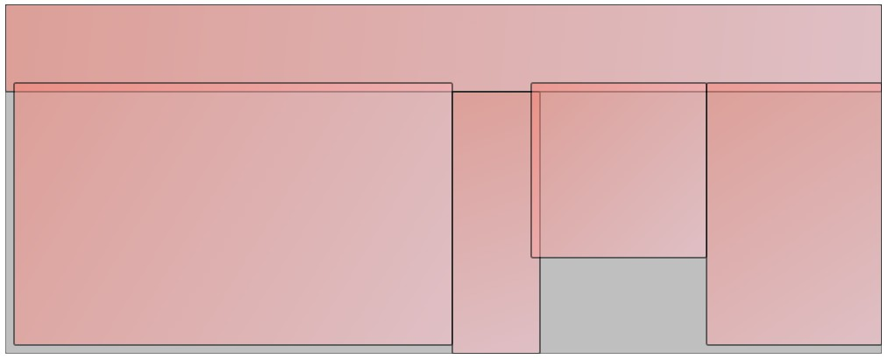

# Mini visualisation of 2D rectangular arrangements

The file [container_arrangements.html](container_arrangements.html) contains a simple JavaScript code for visualising an arrangement of rectangular boxes within a rectangular container.  It is intended to help visualise box arrangements computed by optimisation algorithms.

## Sample arrangement

Note that overlaps are highlighted via box transparency.

## How to use

- Unpack or clone [paper.js](http://paperjs.org/).
- Add `container_arrangements.html` to the paper.js root folder.
- Test it in your browser and adapt it to your needs.
